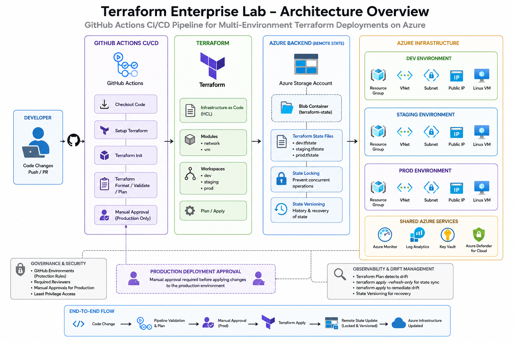

# Terraform Enterprise Platform Lab

## Overview

This project demonstrates an enterprise-style Terraform infrastructure deployment pipeline in Microsoft Azure.

The goal of this lab was to move beyond simple Terraform deployments and focus on:

* Infrastructure as Code (IaC)
* Environment isolation
* Terraform state management
* Drift detection and recovery
* CI/CD automation
* Infrastructure governance
* Production deployment controls

The project uses Terraform, Azure, and GitHub Actions to deploy and manage multiple isolated environments.

---

# Architecture

## High-Level Flow

```text
GitHub Actions
        ↓
Terraform Workflows
        ↓
Azure Remote Backend (Blob Storage State)
        ↓
Azure Infrastructure
```
---
## Architecture Diagram



---
---

## Infrastructure Architecture

```text
Azure Subscription
│
├── Remote Terraform Backend
│     ├── Storage Account
│     └── Blob Container
│
├── DEV Environment
│     ├── Resource Group
│     ├── Virtual Network
│     ├── Subnet
│     ├── Public IP
│     └── Linux VM
│
├── STAGING Environment
│     ├── Resource Group
│     ├── Virtual Network
│     ├── Subnet
│     ├── Public IP
│     └── Linux VM
│
└── PROD Environment
      ├── Resource Group
      ├── Virtual Network
      ├── Subnet
      ├── Public IP
      └── Linux VM
```

---

# Technologies Used

* Terraform
* Microsoft Azure
* Azure Blob Storage Backend
* GitHub Actions
* GitHub Environments
* Azure Service Principals
* VS Code

---

# Key Concepts Demonstrated

## Multi-Environment Infrastructure

Terraform workspaces were used to isolate:

* dev
* staging
* prod

Each environment maintains independent Terraform state and infrastructure resources.

---

## Remote Terraform State

Terraform state is stored remotely in Azure Blob Storage.

Benefits include:

* centralized state management
* state locking
* collaboration support
* persistence
* protection against local state loss

---

## State Locking

The Azure backend provides Terraform state locking to prevent concurrent infrastructure operations.

This prevents:

* state corruption
* overlapping deployments
* conflicting Terraform operations

---

## Drift Detection & Recovery

Infrastructure drift was intentionally introduced by modifying Azure resources manually through the Azure Portal.

Terraform detected drift using:

```bash
terraform plan
```

State synchronization was tested using:

```bash
terraform apply -refresh-only
```

Drift recovery was completed using:

```bash
terraform apply
```

---

## Terraform Modules

Infrastructure was refactored into reusable modules:

```text
modules/
├── network/
└── vm/
```

This improved:

* reusability
* scalability
* maintainability
* infrastructure organization

---

# CI/CD Pipeline

GitHub Actions was used to automate Terraform validation and deployment workflows.

---

## Terraform CI Workflow

The CI pipeline performs:

* terraform init
* terraform fmt -check
* terraform validate
* terraform plan

This ensures infrastructure changes are validated automatically before deployment.

---

## Production Deployment Workflow

Production deployments require:

* manual workflow execution
* GitHub Environment approval
* production workspace targeting

This introduces governance and deployment safety controls.

---

# Environment Strategy

## Development

Purpose:

* testing
* experimentation
* validation

Characteristics:

* smaller VM sizing
* rapid iteration

---

## Staging

Purpose:

* pre-production validation
* deployment testing

Characteristics:

* mirrors production more closely

---

## Production

Purpose:

* protected environment
* governed deployments

Characteristics:

* approval gates
* larger VM sizing
* controlled deployment workflow

---

# Repository Structure

```text
terraform-enterprise-lab/
│
├── .github/workflows/
│   ├── terraform-ci.yml
│   └── terraform-prod.yml
│
├── environments/
│   ├── dev.tfvars
│   ├── staging.tfvars
│   └── prod.tfvars
│
├── modules/
│   ├── network/
│   └── vm/
│
├── main.tf
├── variables.tf
├── outputs.tf
├── provider.tf
└── README.md
```

---

# Lessons Learned

## Terraform Is a State Reconciliation Engine

Terraform compares:

* desired configuration
* Terraform state
* actual infrastructure

Understanding this relationship was one of the most important takeaways from the lab.

---

## State Is Critical

Terraform state management is one of the most important operational aspects of Infrastructure as Code.

This project reinforced:

* why remote state matters
* why locking exists
* how drift occurs
* how state can become inconsistent

---

## Infrastructure Requires Governance

Production infrastructure should not be deployed automatically without controls.

Approval workflows and environment protections improve deployment safety and operational maturity.

---

## CI/CD Applies to Infrastructure

Infrastructure deployments benefit from the same automation, validation, and review processes used in software engineering.

---

# Future Improvements

Potential future enhancements include:

* Azure Key Vault integration
* OIDC authentication with GitHub Actions
* Drift detection scheduling
* Network Security Groups (NSGs)
* Bastion host deployment
* Private networking
* Monitoring and alerting
* Terraform security scanning
* Staging promotion workflows

---

# Author

Built as a hands-on Terraform and Azure platform engineering lab focused on real-world Infrastructure as Code practices.
